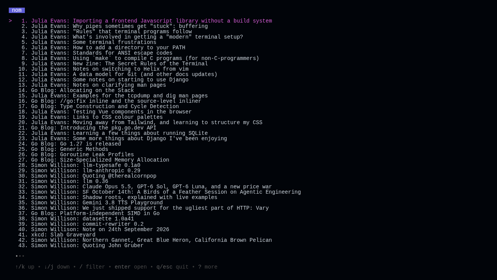
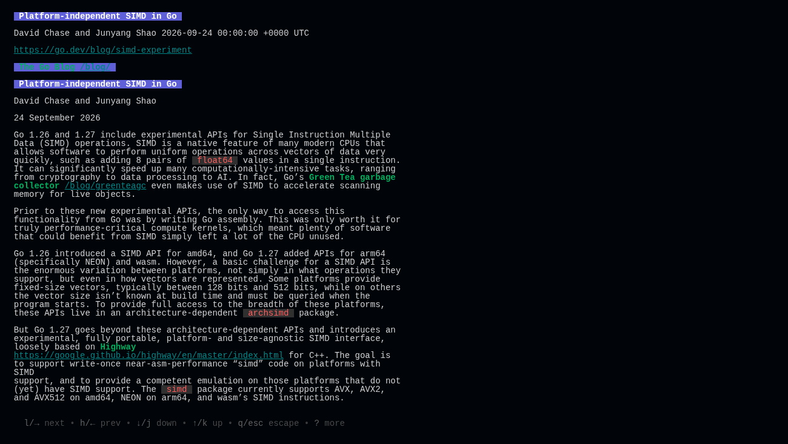
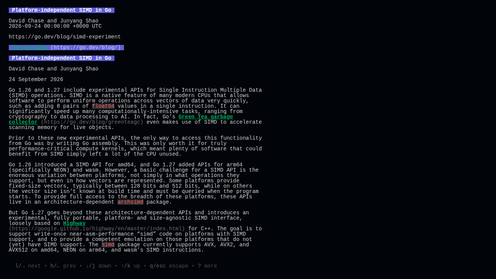

# nom on Limoni: screenshots and measurements

Supporting material for the [`limoni` branch](https://github.com/thebanri/nom/tree/limoni), which moves nom's TUI from Bubble Tea to [Limoni](https://github.com/thebanri/limoni) and shows article pictures (#99). This branch has nothing to merge.

## Screenshots

Taken in a browser through xterm.js (`limoni serve` + headless Chromium). The same database and window are used for both versions.

| before (Bubble Tea v1.2.4) | after (Limoni v0.10.0) |
|:--|:--|
|  |  |
|  |  |

A picture, drawn in half blocks because xterm.js here has no image protocol. In kitty, iTerm2 and Sixel terminals the picture itself is placed instead.

## Measurements

- [`harness/main.go`](harness/main.go) starts the program in a 100×30 pty with `TERM=xterm-256color`. It answers capability queries through a terminal emulator (`charmbracelet/x/vt`) and sends a fixed key script. For each key it records the bytes written and the time until output goes quiet for 80 ms (first and last byte). After the script it takes idle CPU over 10 s and peak RSS from `/proc`.
- [`harness/run.sh`](harness/run.sh) runs a binary three times, each time against a fresh copy of the same SQLite database. The database holds 114 items from seven real feeds, served locally.
- [`results/`](results) has the raw JSON: `res-bt-*` is nom `7f38ccc` (Bubble Tea v1.2.4, bubbles v0.18.0, glamour v0.10.0), and `res-lim-*` is the `limoni` branch with `images: false`.

Medians of three runs:

| step | before, bytes | after, bytes | before, ms | after, ms |
|:--|--:|--:|--:|--:|
| list down ×36 | 13,682 | 7,313 | 13.6 | 0.1 |
| list up ×5 | 1,505 | 1,017 | 13.7 | 0.1 |
| list down ×5 | 1,505 | 992 | 12.8 | 0.1 |
| open a long article | 19,744 | 2,082 | 30.4 | 9.7 |
| scroll it ×30 | 395,386 | 3,075 | 13.8 | 0.2 |
| page down ×3 | 52,426 | 11,935 | 14.3 | 0.2 |
| end | 20,466 | 3,239 | 12.8 | 0.2 |
| top | 17,829 | 2,082 | 13.8 | 0.2 |
| next article ×3 | 30,702 | 3,181 | 13.6 | 0.5 |
| back to the list (Esc) | 3,525 | 2,473 | 12.6 | 27.3 |
| `/` | 3,316 | 2,334 | 13.6 | 0.2 |
| type `go` | 5,152 | 3,445 | 12.7 | 0.4 |
| Enter | 3,579 | 536 | 13.7 | 0.4 |
| Esc | 3,252 | 2,272 | 13.7 | 25.3 |
| **total** | **572,069** | **45,976** | | |

| | before | after |
|:--|--:|--:|
| start → first full frame | 33 ms | 6.8 ms |
| CPU while idle, 10 s | 30 ms | 0 ms |
| peak RSS | 66.6 MB | 30.8 MB |
| binary | 30.1 MB | 19.5 MB |

How to read these numbers:

- **Bytes.** Most of the scrolling difference is scroll regions (DECSTBM + SU/SD), which Bubble Tea v1's renderer does not use and v2's does.
- **Latency.** Bubble Tea v1 draws on a 60 fps ticker, so its ~13 ms is mostly waiting for the next frame.
- **Esc.** Esc is slower after the move: Limoni waits 25 ms after a lone ESC byte to tell the key apart from a split escape sequence. That wait disappears in terminals with the kitty keyboard protocol, but the measurement terminal had none.
